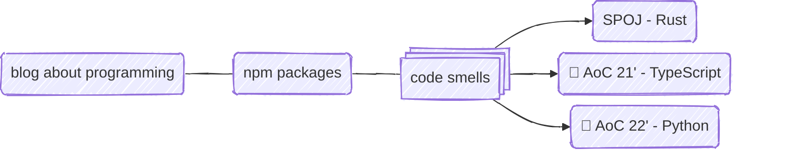

```mermaid
---
config:
  look: handDrawn
  # theme: neutral
  securityLevel: antiscript
  flowchart:
    diagramPadding: 0
    nodeSpacing: 10
    rankSpacing: 50
    padding: 10
---
flowchart LR
    BLOG(blog about programming)
    NPM(npm packages)
    CODE@{ shape: st-rect, label: "code smells"}
    A(SPOJ - Rust)
    B(🎄 AoC 21' - TypeScript)
    C(🎄 AoC 22' - Python)

    BLOG --- NPM --- CODE
    CODE --> A
    CODE --> B
    CODE --> C
    B ~~~ END:::HIDDEN

    click BLOG href "https://twistezo.github.io/blog/" "Tooltip" _blank
    click NPM href "https://www.npmjs.com/~twistezo" "Tooltip" _blank
    click A href "https://github.com/twistezo/spoj-tournament" "Tooltip" _blank
    click B href "https://github.com/twistezo/advent-of-code-2021" "Tooltip" _blank
    click C href "https://github.com/twistezo/advent-of-code-2021" "Tooltip" _blank

    classDef HIDDEN display: none;
    %% classDef styles fill:#fff
    %% class BLOG,NPM,CODE,A,B,C styles
```
