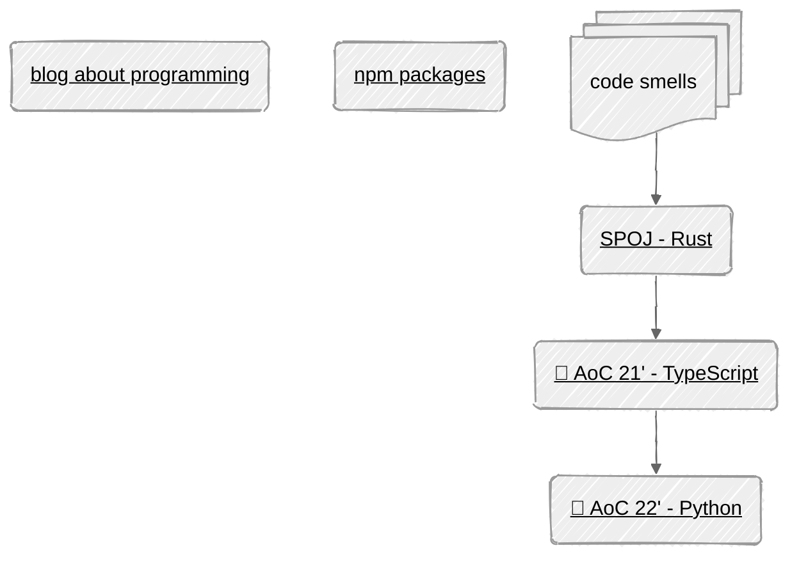

```mermaid
---
config:
  look: handDrawn
  theme: neutral
---
flowchart TD
    blog(<a href="https://twistezo.github.io/blog/" style="color:black !important">blog about programming</a>)
    npm_packages(<a href="https://www.npmjs.com/~twistezo" style="color:black !important">npm packages</a>)

    code_smells@{ shape: docs, label: "code smells"}
    A(<a href="https://github.com/twistezo/spoj-tournament" style="color:black !important">SPOJ - Rust</a>)
    B(<a href="https://github.com/twistezo/advent-of-code-2021" style="color:black !important">🎄 AoC 21' - TypeScript</a>)
    C(<a href="https://github.com/twistezo/advent-of-code-2021" style="color:black !important">🎄 AoC 22' - Python</a>)

    blog & npm_packages & code_smells
    code_smells --> A --> B --> C
```
