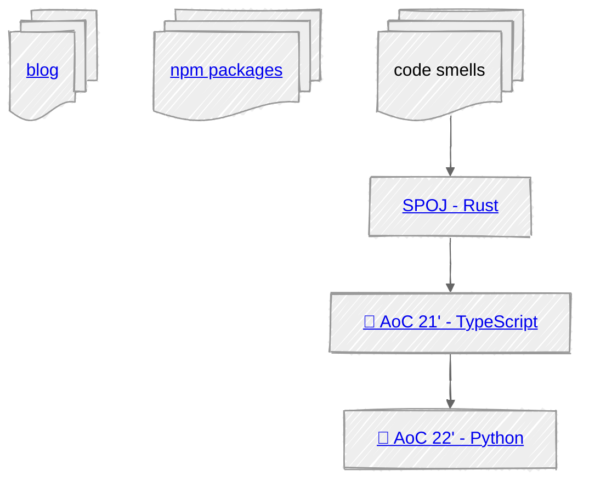

```mermaid
---
config:
  look: handDrawn
  theme: neutral
---
flowchart TD
    blog & npm_packages & code_smells
    blog@{ shape: docs, label:[<a href="https://twistezo.github.io/blog/" style="">blog</a>]}
    npm_packages@{ shape: docs, label:[<a href="https://www.npmjs.com/~twistezo" style="">npm packages</a>]}
    
    code_smells@{ shape: docs, label: "code smells"} --> A[<a href="https://github.com/twistezo/spoj-tournament" style="">SPOJ - Rust</a>]
    A --> B[<a href="https://github.com/twistezo/advent-of-code-2021" style="">🎄 AoC 21' - TypeScript</a>]
    B --> C[<a href="https://github.com/twistezo/advent-of-code-2021" style="">🎄 AoC 22' - Python</a>]

```
